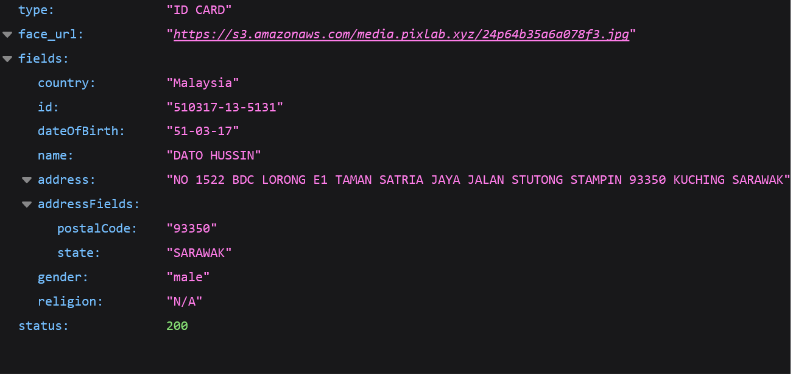

<p align="center">
    <br>
</p>

# Memindai Kad Pengenalan Malaysia dengan API PixLab: Panduan Lengkap

Dalam artikel ini, kami akan meneroka bagaimana menggunakan **API PixLab** untuk mengimbas kad pengenalan Malaysia, termasuk **MyKAD**, **MyKID**, dan **Lesen Memandu Malaysia**. API Pemindai Dokumen PixLab menyediakan penyelesaian yang cekap dan tepat untuk melaksanakan borang KYC (Kenali Pelanggan Anda) yang minimal tetapi berfungsi dan pengesahan identiti untuk pengguna Malaysia.

## Kandungan

- [Pengenalan](#Pengenalan) 
- [Memahami Format Kad Pengenalan Malaysia:](#Format)

1. [MyKAD](#MyKAD)
2. [MyKID](#MyKID)
3. [Lesen Memandu Malaysia](#Lesen)

- [Memindai Kad Pengenalan Malaysia dengan API PixLab](#Memindai)

- [Melaksanakan Pengesahan KYC dengan API PixLab:](#Melaksanakan)

1. [Kod Python](#Python)
2. [Kod PHP](#PHP)

- [Kesimpulan](#Kesimpulan)


## Pengenalan<a name="Pengenalan"></a>
Kad pengenalan Malaysia memainkan peranan penting dalam menetapkan identiti dan kewarganegaraan bagi individu di Malaysia. MyKAD adalah dokumen pengenalan rasmi bagi warganegara, manakala MyKID adalah untuk individu di bawah 12 tahun, dan lesen memandu Malaysia berfungsi sebagai kad pengenalan dan permit memandu.

## Memahami Format Kad Pengenalan Malaysia: <a name="Format"></a>
Sebelum kita teruskan dengan proses mengimbas, mari kita memahami secara ringkas format kad pengenalan Malaysia.

**1. MyKAD:** <a name="MyKAD"></a>Kad Pengenalan Pendaftaran Negara Malaysia (MyKAD) mengandungi maklumat penting seperti nama, nombor ID, jantina, tarikh lahir, dan alamat. Ia juga memuatkan gambar pemegang kad.

**2. MyKID:** <a name="MyKID"></a>MyKID adalah serupa dengan MyKAD tetapi direka khas untuk individu di bawah 12 tahun. Ia mengandungi nama anak, nombor ID, jantina, tarikh lahir, dan maklumat penjaga.

**3. Lesen Memandu Malaysia:** <a name="Lesen"></a>Lesen Memandu Malaysia berfungsi sebagai dokumen pengenalan dan permit memandu. Ia termasuk nama pemandu, nombor ID, alamat, tarikh lahir, dan gambar.

## Memindai Kad Pengenalan Malaysia dengan API PixLab <a name="Memindai"></a>
API Pemindai Dokumen [PixLab](https://pixlab.io/cmd?id=docscan) menawarkan pendekatan yang mudah untuk mengimbas kad pengenalan Malaysia. Kami akan menggunakan titik akhir /docscan/idcard API PixLab untuk mengimbas imej-imej yang disediakan bagi MyKAD, MyKID, dan Lesen Memandu Malaysia. Bagi setiap imej, kami akan memaparkan hasil imbasan API, termasuk maklumat yang diekstrak.

[API PixLab](https://pixlab.io/cmd?id=docscan) menyediakan penyelesaian yang ringkas namun berkuasa bagi para pembangun untuk mengintegrasikan keupayaan pengimbasan dokumen ke dalam aplikasi atau platform web mereka. Dengan memanfaatkan algoritma penglihatan komputer dan pembelajaran mesin yang canggih, PixLab dapat mengekstrak maklumat relevan dari kad pengenalan dan pasport yang dipindai, menyelaraskan proses KYC untuk pengesahan identiti yang lancar.


<figcaption>Contoh Kad Pengenalan Input</figcaption>


<figcaption>Medan Kad Pengenalan Diekstrak</figcaption>


<p align="center">
    <br>
    <em>Contoh Kad Pengenalan Input</em>	
</p>


<p align="center">
    <br>
    <em>Medan Kad Pengenalan Diekstrak</em>
</p>


## Melaksanakan Pengesahan KYC dengan API PixLab: <a name="Melaksanakan"></a>
Sekarang, mari kita mula dengan contoh kod yang disediakan oleh PixLab di repositori GitHub mereka untuk mengimbas kad pengenalan Malaysia menggunakan [Python](https://github.com/symisc/pixlab/blob/master/python/id_card_scan.py) dan [PHP](https://github.com/symisc/pixlab/blob/master/PHP/id_card_scan.php). Contoh kod ini menunjukkan bagaimana membuat permintaan API, mengendalikan respons, dan mengekstrak maklumat dari dokumen yang telah diimbas.

### Kod Python <a name="Python"></a>
Untuk mengakses sampel kod Python, sila ikuti pautan ini:

```
import requests
import json

# Diberi kad pengenalan yang dikeluarkan oleh kerajaan dari Malaysia,
# Singapura, dll., keluarkan wajah pengguna dan huraikan 
# semua medan.
#
# Contoh penggunaan pemindai kad ID dari PixLab.
#
# Dalam sampel ini, kami akan mengimbas Kad Pengenalan dari Malaysia (MyKAD); 
# oleh itu, kami akan mengekstrak wajah pengguna, tarikh lahir,
# nama penuh, alamat, dan agama sekiranya tersedia.
#
# PixLab mengesyorkan agar anda menghubungkan bakul AWS S3 anda
# melalui papan pemuka anda di https://pixlab.io/dashboard
# Supaya mana-mana wajah yang dipotong atau pemangkasan MRZ
# disimpan secara automatik di dalam bucket S3 anda dan bukannya
# di PixLab.
# Keistimewaan ini sepatutnya memberi anda kawalan penuh ke atas
# fail media yang dianalisis anda.
#
# Untuk maklumat lanjut, layari https://pixlab.io/cmd?id=docscan .

req = requests.get('https://api.pixlab.io/docscan',params={
    'img':'https://buletinonline.net/v7/wp-content/uploads/2016/06/Mykad-penghuni-puan-Noraini-2.jpg', # ID Card sample
    'type':'idcard', # We are expecting a Malaysian (MyKAD) ID card
    'country': 'my', # Malaysia Country Code
    'key':'PIXLAB_API_KEY' # Visit https://console.pixlab.io/ to get your API key
})
reply = req.json()
if reply['status'] != 200:
    print (reply['error'])
else:
    print ("User Cropped Face: " + reply['face_url'])
    # print ("Scanned Text: " + reply['full_text'])
    print ("Fields: ")
    # Display all scanned fields
    if "country" in reply['fields']:
        print ("\tIssuing Country: " + reply['fields']['country'])
    if "id" in reply['fields']:
        print ("\tID number: " + reply['fields']['id'])
    if "name" in reply['fields']:
        print ("\tName: " + reply['fields']['name'])
    if "address" in reply['fields']:
        print ("\tAddress: " + reply['fields']['address'])
    if "religion" in reply['fields']:
        print ("\tReligion: " + reply['fields']['religion'])
    if "sex" in reply['fields']:
        print ("\tSex: " + reply['fields']['sex'])
    if "race" in reply['fields']:
        print ("\tRace: " + reply['fields']['race'])
    if "dateOfBirth" in reply['fields']:
        print ("\tDate of birth: " + reply['fields']['dateOfBirth'])
    if "birth_country" in reply['fields']:
        print ("\tCountry of birth: " + reply['fields']['birth_country'])
    if "nationality" in reply['fields']:
        print ("\tNationality: " + reply['fields']['nationality'])
```

### kod PHP <a name="PHP"></a>
Untuk mengakses sampel kod PHP, sila ikuti pautan ini: https://github.com/symisc/pixlab/tree/master/PHP

```
<?php
/*
 * Contoh penggunaan pengimbas kad ID daripada PixLab.
* Dalam contoh ini, kita akan mengimbas Kad ID dari Malaysia (MyKAD);
* oleh itu, kita akan mengeluarkan wajah pengguna, tarikh lahir,
* nama penuh, alamat, dan agama jika tersedia.

 */ 
/*
 * Klien PixLab PHP merupakan fail PHP tunggal yang tidak 
 * memerlukan sebarang ketergantungan dan boleh didapatkan dari Github
 * https://github.com/symisc/pixlab-php 
 */
require_once "pixlab.php";
# Diberi kad ID yang dikeluarkan oleh kerajaan dari Malaysia, UAE, India, pemandu dari Amerika, Singapura, dan lain-lain, ekstrak wajah pengguna dan analisis semua medan.
#
# PixLab mengesyorkan agar anda menyambungkan bakul AWS S3 anda melalui papan pemuka anda di https://pixlab.io/dashboard
# Jadi mana-mana wajah yang dipotong atau potongan MRZ disimpan secara automatik di dalam baldi S3 anda berbanding dengan PixLab.
# Fitur ini sepatutnya memberikan anda kendali penuh ke atas fail media yang dianalisis anda.
#
# Untuk maklumat lanjut, layari https://pixlab.io/cmd?id=docscan.

$idcard_link = 'https://buletinonline.net/v7/wp-content/uploads/2016/06/Mykad-penghuni-puan-Noraini-2.jpg'; /* ID card prototype: Of course, replace with a real government issued id. */
$key = 'PIXLAB_API_KEY'; # Your PixLab API key that you can fetch from https://pixlab.io/dsahboard
/* Process */
$pix = new Pixlab($key);
if( !$pix->get('docscan',[
	'img' => $idcard_link, # ID Card Scanned Image
	'type' => 'idcard', # Type of document we are going to scan 
	'country' => 'my' # Malysia country code
	]) ){
	echo $pix->get_error_message()."\n";
	die;
}
/* Output the scan result */
echo "User Cropped Face: " . $pix->json->face_url . "\n";
#echo "Raw Text: " . $pix->json->full_text . "\n";
echo "Fields:\n";
# At this stage, the face should be extracted and the array populated with the appropriate information.
if( isset($pix->json->country) )  echo  "Country: ".$pix->json->fields->country . "\n";
if( isset($pix->json->fields->id) )       echo  "ID: ".$pix->json->fields->id . "\n";
if( isset($pix->json->fields->name) )     echo  "Name: ".$pix->json->fields->name . "\n";
if( isset($pix->json->fields->address) )  echo  "Address: ".$pix->json->fields->address . "\n";
if( isset($pix->json->fields->religion) ) echo  "Religion: ".$pix->json->fields->religion . "\n";
if( isset($pix->json->fields->sex) )      echo  "Sex: ".$pix->json->fields->sex . "\n";
if( isset($pix->json->fields->race) )     echo  "Race: ".$pix->json->fields->race . "\n";
if( isset($pix->json->fields->birth) )    echo  "Date of birth: ".$pix->json->fields->birth . "\n";
if( isset($pix->json->fields->birth_country) ) echo  "Country of birth: ".$pix->json->fields->birth_country . "\n";
if( isset($pix->json->fields->nationality) )   echo  "Nationality: ".$pix->json->nationality . "\n";
?>

```

## Kesimpulan: <a name="Kesimpulan"></a>
Pemindaian kad pengenalan Malaysia seperti **MyKAD**, **MyKID**, dan **lesen memandu Malaysia** menggunakan [API PixLab](https://pixlab.io/cmd?id=docscan) menyederhanakan proses pengesahan KYC bagi pengguna Malaysia. API ini menyediakan ekstraksi maklumat yang boleh dipercayai dan tepat, menyusun alur kerja pengesahan identiti untuk aplikasi web dan platform.

Dengan menggabungkan API Pemindai Dokumen PixLab ke dalam proses KYC anda, anda dapat meningkatkan pengalaman pengguna, memastikan pematuhan, dan mengesahkan keaslian **kad pengenalan Malaysia** secara efisien. Ciri-ciri hebat API PixLab, yang digabungkan dengan sampel kod yang disediakan, menjadikan lebih mudah bagi pembangun untuk menyatukan kemampuan pemindaian dokumen ke aplikasi mereka.

Untuk maklumat lanjut mengenai API Pemindai Dokumen PixLab dan sokongannya untuk kad pengenalan dan pasport, sila rujuk catatan blog rasmi mereka: https://blog.pixlab.io/2019/11/docscan-api-endpoint-support-id-cards-passports

Biarkan API hebat PixLab menangani keperluan pemindaian dokumen anda dan tingkatkan proses pengesahan identiti anda kepada tahap kecekapan dan ketepatan yang baru. Dengan [PixLab](https://pixlab.io/cmd?id=docscan), anda dapat mencipta sistem pengesahan KYC yang kukuh dan selamat untuk pengguna Malaysia, memastikan keaslian dan kredibiliti pengguna platform anda.
